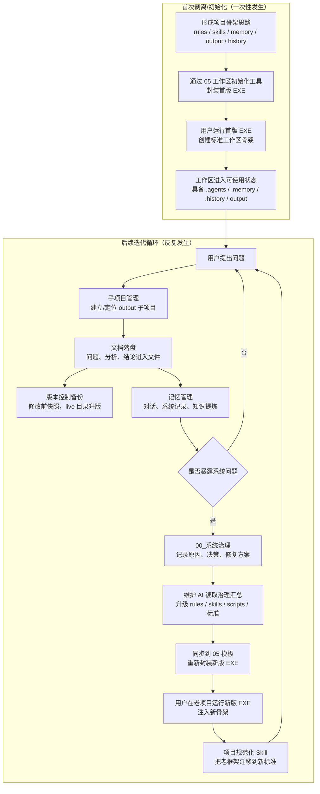

# 项目骨架维护总览

> 版本：v1.0.0 | 创建时间：2026-05-05
> 用途：给后续维护项目骨架的 AI 使用，说明“使用、记录、治理、封装、迁移、继续使用”的闭环。

---

## 一句话理解

这个项目不是一个单次问答资料库，而是一个可以自我记录、自我治理、再把治理成果封装回初始化工具的知识工作区系统。

它分成“一次性的首次剥离/初始化”和“后续反复发生的迭代循环”两层：

---

## 当前骨架分工

| 位置 | 角色 | 维护重点 |
|------|------|----------|
| `output/00_系统治理_*` | 系统治理中枢 | 记录系统问题、设计决策、治理方案、后续维护入口 |
| `output/03_项目运作机制_*` | 用户侧运作说明 | 解释这个工作区平时如何工作 |
| `output/05_工作区初始化工具_*` | 骨架发布器 | 保存初始化工具源码、模板、构建脚本和封装后的 EXE |
| `output/09_项目检查标准_*` | 规范化标准 | 定义老项目迁移和框架体检时要对齐的结构标准 |
| `.agents/rules` | 当前工作区规则 | 约束 AI 的方向、命名、记忆、版本管理行为 |
| `.agents/skills` | 当前工作区技能 | 执行子项目管理、版本备份、记忆管理、规范化等动作 |
| `.memory` | 长期记忆 | 记录对话摘要、系统记录、知识提炼和全局知识地图 |
| `.history` | 历史快照 | 保存 output、.agents、.memory 版本化历史 |

---

## 05 子项目的定位

`05_工作区初始化工具` 是“骨架封装器”，不是普通研究文档目录。

它里面最关键的是：

| 路径 | 含义 |
|------|------|
| `src/init_workspace.py` | 初始化工作区的主程序逻辑 |
| `src/templates/rules` | 新工作区会获得的规则模板 |
| `src/templates/skills` | 新工作区会获得的技能模板 |
| `src/build.ps1` | 重新封装 EXE 的构建脚本 |
| `dist/*.exe` | 给用户实际使用的初始化/更新工具 |

所以，系统治理产生的新规则、新技能、新脚本修复，最终都不能只停留在当前工作区的 `.agents` 里；如果它们要成为“新骨架”，就必须同步进 `05/src/templates`，再重新构建 EXE。

---

## 00 系统治理的定位

`00_系统治理` 是后续维护 AI 的入口，不负责直接生成 EXE，但负责说明“为什么要改、改什么、按什么顺序改”。

建议维护 AI 的读取顺序：

1. 先读本文件，理解闭环。
2. 再读 `系统变更全记录.md`，理解已有系统改动的因果链。
3. 再读当前目录下具体问题文档，定位某个规则、技能或脚本问题。
4. 再读 `output/09_项目检查标准_*`，确认新骨架应满足哪些结构标准。
5. 最后进入 `.agents` 和 `output/05_工作区初始化工具_*`，执行实际升级与封装。

---

## 老项目升级语义

用户在老项目中运行新版 EXE，只表示“把新版骨架资产带进老工作区”。这一步通常能更新或补齐 `.agents`、`.memory`、`.history`、`input`、`output` 等基础结构，但不等同于完成全部迁移。

真正的迁移应分两步：

1. **骨架注入**：运行新版 EXE，让老项目获得最新 rules、skills、模板目录和基础结构。
2. **规范化迁移**：调用项目规范化/框架体检类 Skill，按 `09_项目检查标准` 把旧目录、旧命名、旧记忆文件、旧历史快照整理到新标准。

这能避免一个风险：EXE 只负责“带来新骨架”，规范化 Skill 负责“理解老项目并迁移老状态”。二者职责分开，升级过程更可控。

---

## 维护闭环的操作顺序

### 1. 使用阶段

用户提出普通问题时：

- 先由子项目管理 Skill 建立或定位 output 子项目。
- 实质回答必须落盘为文档。
- 修改 output 前必须执行版本控制备份。
- 回答结束前写入对话记忆；如果有知识沉淀，再写入知识提炼。

### 2. 治理阶段

当发现系统问题时：

- 问题、根因、修复方案统一进入 `00_系统治理`。
- 系统记录写入 `.memory/系统记录` 的对应分类文件。
- 如果问题暴露出可复用教训，应同步进入教训库。

### 3. 骨架升级阶段

维护 AI 根据 `00_系统治理` 的汇总和具体问题文档：

- 修改当前工作区的 `.agents/rules`、`.agents/skills` 或脚本。
- 修改前按目标类型执行 CONFIG、FOLDER、PROJECT 或 MEMORY 备份。
- 修完后用 `09_项目检查标准` 做结构一致性检查。

### 4. 封装发布阶段

当治理成果确认要进入新骨架：

- 将最新 `.agents/rules` 同步到 `05/src/templates/rules`。
- 将最新 `.agents/skills` 同步到 `05/src/templates/skills`。
- 必要时更新 `05/src/init_workspace.py`，让 EXE 能创建或补齐新目录/新初始文件。
- 更新 `05/src/build.ps1` 中的版本号。
- 重新构建 EXE，并把产物放入 `05/dist`。
- 更新 `05_工作区初始化工具` 的版本记录。

### 5. 老项目迁移阶段

用户拿到新版 EXE 后，在老项目中运行：

- 先让老项目获得新骨架。
- 再由项目规范化 Skill 对照 `09_项目检查标准` 整理旧框架。
- 迁移完成后，用户继续按新规则提问、落盘、记忆、备份。

---

## 维护 AI 的判断原则

- `00` 解决“为什么改、改什么、改动的历史因果”。
- `05` 解决“怎么把改动变成用户可运行的新骨架”。
- `09` 解决“新旧项目是否符合统一标准”。
- `.agents` 是当前工作区实际生效的规则和技能。
- `05/src/templates` 是未来新工作区会获得的规则和技能。
- 当前 `.agents` 改了但 `05/templates` 没同步，说明“本工作区修好了，但新 EXE 还没继承”。
- `05/templates` 改了但没有重新构建 EXE，说明“骨架源码修好了，但用户还拿不到”。
- EXE 运行过但没执行规范化，说明“老项目拿到了新骨架，但旧状态还没有全部迁移”。

---

## 待完善项

1. 明确新版 EXE 在老项目中运行时，是“覆盖更新”、 “仅补缺”，还是“先备份再合并”。
2. 为 05 增加一份标准发布清单：同步模板、改版本号、构建、校验、记录。
3. 为项目规范化 Skill 补齐“老骨架迁移到新骨架”的完整步骤和回滚策略。
4. 将 `00_系统治理` 是否应成为新工作区默认初始子项目纳入后续评估。

---

## 本次留档结论

用户的整体思路可以理解为一套“自我演化的知识工作区骨架”：

> 用 EXE 分发骨架，用 Skill 驱动日常落盘、版本和记忆；用 00 系统治理记录系统问题和维护决策；用 05 把维护成果重新封装成 EXE；用项目规范化把老项目迁移到新骨架；然后继续使用、继续记录、继续迭代。
