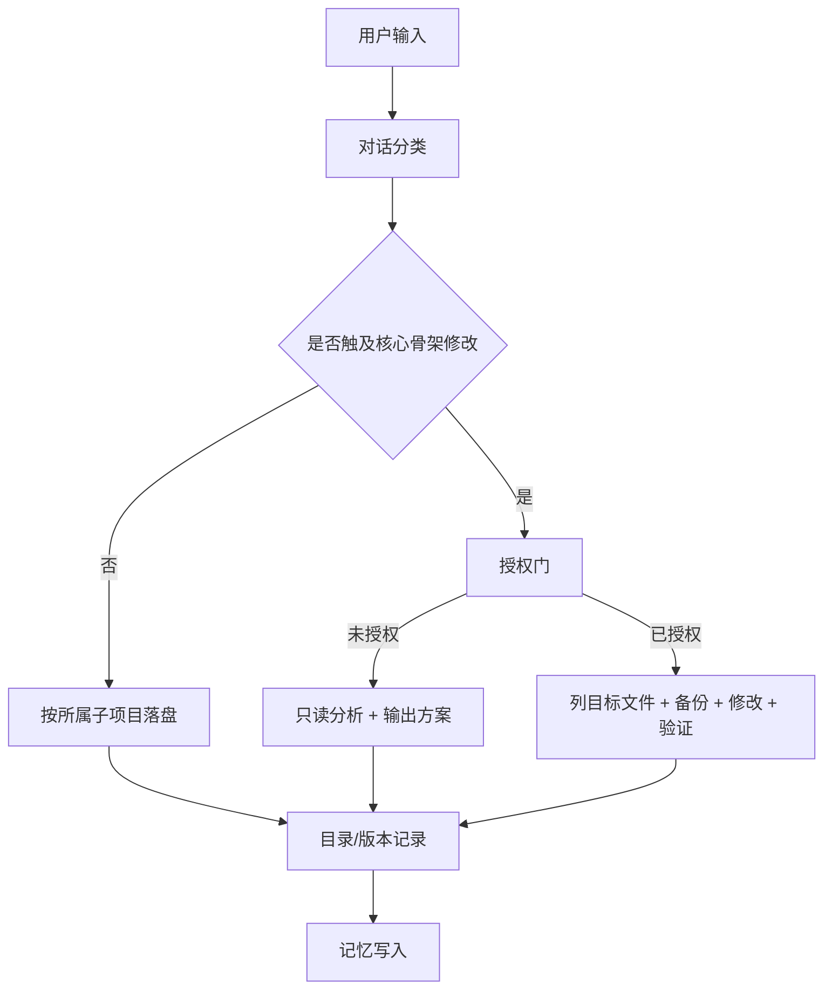

# 系统治理三道防线完整方案

> 依据：`input\暂存需求.md`
> 版本：v1.0.0
> 日期：2026-05-07
> 状态：方案已落盘，尚未获得授权修改核心骨架

---

## 0. 要解决的三个问题

本方案处理三个系统级问题：

1. `课题研究` Skill 的参考资料必须可访问、可验证或可下载，并且要能说明“现在依然权威”。
2. 未经用户明确允许，AI 不得修改核心骨架中的 Rule、Skill、脚本、标准和初始化模板。
3. 用户的任意对话都要能先分类，再固化为稳定流程：先走哪个 Rule，再走哪个 Skill，再怎么落盘、备份、记忆。

这三个问题不能只靠 AI 记住，必须形成三道硬防线：

| 防线 | 管什么 | 目标 |
|------|--------|------|
| 来源核验防线 | 研究资料、参考文献、第一性原理来源 | 结论可复查、来源可访问、权威性有当前证据 |
| 核心骨架授权防线 | `.agents`、`.system`、关键脚本、05 初始化模板 | 未授权不改核心骨架 |
| 对话路由防线 | 所有用户输入的分类与执行链路 | 每类请求都有固定流程，不靠临场发挥 |

---

## 1. 总体设计

### 1.1 分层原则

系统分为四层：

| 层级 | 内容 | 默认权限 |
|------|------|----------|
| L1 资料层 | `input/`、用户提供的材料、可核验外部来源 | 可读，可作为依据 |
| L2 输出层 | `output/` 子项目文档、代码、方案 | 可按版本规则修改 |
| L3 记忆层 | `.memory/对话记录`、`.memory/系统记录`、`.memory/知识提炼` | 追加或按 MEMORY 规则修改 |
| L4 核心骨架层 | `.agents/rules`、`.agents/skills`、`.system/standards`、核心脚本、05 模板 | 未授权只读，不得修改 |

关键规则：

- L2 输出层可以承接方案、分析、研究结论。
- L3 记忆层用于记录事实，不替代方案正文。
- L4 核心骨架层只有在用户明确授权后才能修改。
- “出方案”不等于“允许改骨架”。

### 1.2 执行总流程



---

## 2. 来源核验防线

### 2.1 适用范围

适用于所有研究型输出，尤其是：

- `课题研究` Skill 生成的结构化研究文档
- 第一性原理、经典出处、权威研究、标准文件
- 健康、医学、法律、金融、技术标准等高风险或易变领域
- 用户要求“权威”“最新”“可靠”“可验证”的任何结论

### 2.2 资料准入标准

每条参考资料必须至少满足以下三类之一：

| 类别 | 要求 | 示例 |
|------|------|------|
| 可访问 | 有当前可打开的官方页面、期刊页面、出版社页面、标准页面 | 官方网页、DOI 页面、PubMed 页面 |
| 可验证 | 有 DOI、ISBN、标准编号、档案编号、版本号、作者机构等可复核标识 | DOI、ISBN、GB/T 编号、RFC 编号 |
| 可下载 | 有 PDF、数据集、标准文件、网页快照或本地归档路径 | 官方 PDF、机构报告下载页 |

禁止把以下内容作为核心依据：

- 只有模型记忆、没有可复核路径的资料
- 只说“权威机构认为”，但不给机构、文件、版本或访问路径
- 不知道当前是否仍有效的旧标准、旧指南、旧论文
- 二手转述替代原始出处，除非明确标注为二手背景

### 2.3 “现在依然权威”的判断标准

“权威”不是一次性标签，而是当前状态判断。每条核心来源至少说明一个当前权威证据：

| 权威证据 | 说明 |
|----------|------|
| 官方维护 | 来源由官方机构、标准组织、期刊、出版社或项目维护 |
| 版本有效 | 页面显示当前版本、发布日期、修订日期或未废止状态 |
| 学界仍引用 | 近期综述、教材、指南仍把它作为基础来源 |
| 标准仍现行 | 标准库、官方目录或维护页面显示未被替代 |
| 可交叉验证 | 至少两个独立权威来源能互相印证 |

输出中不能写“绝对权威”。推荐写法：

> 截至 2026-05-07，该资料可通过 `{访问路径}` 验证；其当前权威性依据是 `{官方维护/版本有效/仍被引用/标准现行}`。

### 2.4 参考资料卡片模板

研究文档的参考文献不再只列标题和链接，改为使用资料卡片：

```markdown
### R01. {资料标题}

- 来源类型：官方标准 / 经典原典 / 期刊论文 / 教材 / 机构报告 / 数据集
- 作者/机构：...
- 年份/版本：...
- 可访问路径：...
- 可验证标识：DOI / ISBN / 标准编号 / 官方编号 / 版本号
- 可下载路径：...
- 访问日期：YYYY-MM-DD
- 当前权威性依据：...
- 使用方式：核心依据 / 背景参考 / 对照资料
```

### 2.5 研究输出的证据等级

所有关键断言必须带证据等级：

| 标签 | 含义 | 使用条件 |
|------|------|----------|
| 【第一来源】 | 原典、原始论文、官方标准、法规原文 | 有可核验原始出处 |
| 【权威研究】 | 同行评议论文、系统综述、权威机构报告 | 有 DOI、期刊、机构或报告编号 |
| 【当前标准】 | 官方仍维护或未废止的规范 | 能查到当前有效状态 |
| 【合理推导】 | AI 基于前述证据做的逻辑延伸 | 必须说明推导链 |
| 【待验证】 | 暂无足够可核验来源 | 不得作为核心结论 |

---

## 3. 核心骨架授权防线

### 3.1 核心骨架范围

以下内容列为核心骨架：

| 类型 | 路径 |
|------|------|
| Rule | `.agents/rules/` |
| Skill | `.agents/skills/` |
| Skill 脚本 | `.agents/skills/*/scripts/` |
| 系统标准 | `.system/standards/` |
| 初始化模板 | `output/05_工作区初始化工具_*/03_代码程序_*/src/templates/` |
| 初始化/规范化/备份关键程序 | 05 子项目中的构建脚本、初始化脚本、规范化脚本 |
| 版本化记忆核心文件 | `.memory/全局知识地图.md`、`.memory/知识提炼/*.md` |

### 3.2 未授权时允许做什么

用户没有明确允许修改核心骨架时，AI 只允许：

- 读取核心骨架文件
- 分析问题和根因
- 提出修改方案
- 列出拟修改文件清单
- 落盘方案到 `output/00_系统治理`
- 追加 `.memory/系统记录`

未授权时禁止：

- 修改 Rule、Skill、脚本、标准、模板
- 顺手修复看见的问题
- 用“这很明显应该改”替代用户授权
- 通过脚本、批处理或工具间接改核心骨架

### 3.3 授权格式

只有出现明确授权语义，才允许进入修改阶段。例如：

- “允许修改核心骨架”
- “按这个方案改 Rule 和 Skill”
- “可以动 `.agents/skills/课题研究`”
- “执行第 1 阶段”

模糊语义不算授权：

- “你看看怎么处理”
- “出个方案”
- “应该要改”
- “这个要解决”

### 3.4 修改前强制清单

获得授权后，修改核心骨架前必须先输出并执行：

| 步骤 | 内容 |
|------|------|
| 1 | 列目标文件和理由 |
| 2 | 判断备份模式：CONFIG / FOLDER / MEMORY / PROJECT |
| 3 | 执行版本控制备份 |
| 4 | 再次确认不触碰未列出的核心文件 |
| 5 | 修改文件 |
| 6 | 运行最小验证 |
| 7 | 写系统记录、知识提炼、必要时更新 05 模板并重新封装 |

### 3.5 技术防线建议

后续可新增一个核心编辑守卫脚本：

```text
guard-core-edit.ps1
```

职责：

- 检查本轮拟修改路径是否属于核心骨架
- 若属于核心骨架，要求传入授权标记
- 检查是否已执行对应备份
- 检查 `.ps1` 文件是否保持 UTF-8 with BOM
- 输出本轮核心修改摘要

这个脚本本身属于核心骨架，必须等用户授权后再创建。

---

## 4. 对话路由防线

### 4.1 先分类，再执行

每轮对话先做两层分类：

1. 内容路由：`PROJECT / SYSTEM / BOTH`
2. 任务类型：研究、问答、代码、规范化、核心修改、记忆治理、文件处理、复盘

### 4.2 路由表

| 用户输入类型 | 内容路由 | 应走 Rule | 应走 Skill | 输出位置 | 记忆位置 |
|--------------|----------|-----------|------------|----------|----------|
| 普通知识问答 | PROJECT | `direction-rules`、`filename-rules` | `子项目管理` | 当前子项目 `01_问题答疑` | `.memory/对话记录` |
| 结构化研究 | PROJECT | `direction-rules`、`filename-rules` | `子项目管理`、`课题研究` | 当前子项目 `02_课题研究` | 对话记录 + 知识提炼 |
| 系统治理方案 | BOTH 或 SYSTEM | `direction-rules`、`memory-rules` | `子项目管理`、`记忆管理` | `output/00_系统治理` | `.memory/系统记录`，必要时知识提炼 |
| Rule/Skill 修改请求 | SYSTEM | `version-control-rules`、`memory-rules` | `版本控制备份`、目标 Skill | 核心骨架，需授权 | `.memory/系统记录` |
| 代码实现 | PROJECT | `filename-rules`、`version-control-rules` | 视项目而定 | 当前子项目 `03_代码程序` | 对话记录 |
| 规范化/体检 | BOTH | `.system/standards`、相关 rules | `框架体检`、`项目规范化` | 目标子项目或 00 异常记录 | 系统记录 + 对话记录 |
| 记忆问题 | SYSTEM | `memory-rules` | `记忆管理` | `.memory/系统记录` 或方案文档 | `.memory/系统记录` |
| 文档/表格/演示文件 | PROJECT | 对应文件规则 | documents / spreadsheets / presentations | 当前子项目对应分类 | 对话记录 |

### 4.3 固定执行链

#### A. 研究类请求

1. 话题归属：找到已有子项目或新建子项目
2. 判断是否需要 `课题研究`
3. 建立资料核验表
4. 只使用可访问、可验证或可下载资料
5. 正文中区分第一来源、权威研究、合理推导
6. 落盘到 `02_课题研究`
7. 更新目录、版本记录、对话记录、知识提炼

#### B. 系统治理类请求

1. 路由到 `00_系统治理`
2. 判断是否触及核心骨架
3. 未授权时只输出方案，不改核心
4. 已授权时先备份，再修改
5. 修改后运行体检或最小验证
6. 写系统记录，必要时更新知识提炼

#### C. 核心骨架修改请求

1. 识别核心路径
2. 进入授权门
3. 用户未明确授权：停止在方案阶段
4. 用户明确授权：列修改清单
5. 执行备份
6. 修改
7. 验证
8. 若影响初始化模板，同步 05 并重新封装
9. 写系统记录和教训库

---

## 5. 落地分阶段方案

### 第 0 阶段：立即执行的行为约束

无需修改核心骨架，从本方案生效后立即按以下方式执行：

- 研究输出必须带资料核验字段
- 未授权不修改核心骨架
- 系统治理方案统一落到 `00_系统治理`
- 所有对话先判 `PROJECT / SYSTEM / BOTH`
- 输出前检查是否需要落盘
- 回复前完成记忆写入

### 第 1 阶段：获得授权后修改 Rule / Skill 文案

建议修改：

| 文件 | 修改内容 |
|------|----------|
| `.agents/rules/direction-rules.md` | 增加“对话路由强制门”和“核心骨架授权门” |
| `.agents/rules/version-control-rules.md` | 增加核心路径修改前授权检查 |
| `.agents/rules/memory-rules.md` | 增加路由表和系统治理记录触发规则 |
| `.agents/skills/课题研究/SKILL.md` | 增加资料卡片、当前权威性、可访问/可验证/可下载要求 |
| `.agents/skills/记忆管理/SKILL.md` | 增加对话分类到记忆分类的映射 |
| `.agents/skills/版本控制备份/SKILL.md` | 增加核心路径修改前授权门提醒 |

### 第 2 阶段：获得授权后新增技术守卫

建议新增：

| 工具 | 作用 |
|------|------|
| `guard-core-edit.ps1` | 核心骨架编辑前检查授权、备份和路径 |
| `verify-references.ps1` 或同类脚本 | 批量检查研究文档中的链接、DOI、下载路径 |
| `route-conversation.md` 或路由 reference | 将路由表变成可被 Skill 读取的稳定指针 |

### 第 3 阶段：同步 05 初始化模板

只要第 1 或第 2 阶段修改了 `.agents` 或 `.system`，就必须：

1. PROJECT 备份 05 子项目
2. 同步当前 `.agents`、`.system` 到 05 模板
3. 重新封装初始化 EXE
4. 验证新 EXE 能初始化包含新防线的工作区
5. 写入系统记录和 05 对话记录

### 第 4 阶段：老项目迁移

对旧工作区不直接手工改。推荐流程：

1. 使用最新版初始化工具注入新骨架
2. 使用 `项目规范化` 检查并修复结构
3. 由大模型按 `.system/standards` 做语义自查
4. 未修复项写入 `00_系统治理/02_课题研究/规范化异常记录`

---

## 6. 验收标准

### 6.1 来源核验验收

一份研究文档合格条件：

- 每条核心参考资料都有访问路径或可验证标识
- 每条核心资料有访问日期
- 每条核心资料说明当前权威性依据
- 不可验证资料不进入核心结论
- 所有 AI 推导明确标注为【合理推导】

### 6.2 核心骨架授权验收

一次核心修改合格条件：

- 修改前有用户明确授权
- 修改前列出目标文件
- 修改前执行正确备份
- 修改中没有触碰未列文件
- 修改后有验证
- 修改后写入系统记录

### 6.3 对话路由验收

一轮对话合格条件：

- 回复前已判定 `PROJECT / SYSTEM / BOTH`
- 已定位输出子项目
- 实质内容已落盘
- 目录和版本记录已同步
- 记忆已写入
- 若触及核心骨架，已进入授权门

---

## 7. 本轮状态

本轮只做方案落盘，不修改核心骨架。

已执行：

- 归属到 `output/00_系统治理`
- PROJECT 备份并升版到 `00_系统治理_v1.5.0`
- 新增本方案文件
- 将 `02_课题研究` 分类文件夹从 `v1.1.0` 升到 `v1.2.0`
- 补齐 00 子项目空分类文件夹 `01_问题答疑_v0.0.0` 和 `03_代码程序_v0.0.0`

待用户授权后才能执行：

- 修改 `.agents/rules`
- 修改 `.agents/skills`
- 新增守卫脚本
- 同步 05 初始化模板并重新封装 EXE

---

## 8. 建议下一步

建议下一步先确认是否执行第 1 阶段。

如果确认，建议授权范围写成：

> 允许按 `12_系统治理三道防线完整方案_v1.0.0.md` 的第 1 阶段修改 `.agents/rules` 和 `.agents/skills`，但暂不新增脚本、暂不封装 05。

这样可以先把规则和技能行为收紧，再决定要不要继续做技术守卫和初始化工具发布。

