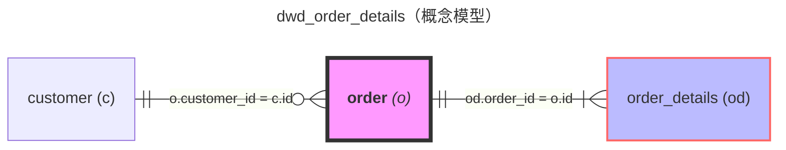
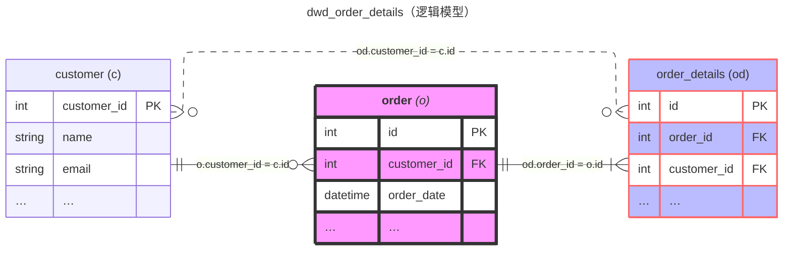

# ER 图生成专家

本技能帮助根据 SQL 代码、业务需求或数据模型描述，生成符合标准的概念模型和逻辑模型 ER 图。

## 何时使用此技能

- 用户需要绘制 ER 图
- 用户有 SQL 代码需要可视化表关系
- 数据库设计、数据仓库建模
- 需要展示表之间的关联关系

## 核心能力

| 能力 | 说明 |
|------|------|
| **概念模型** | 仅展示表名和关系，不含字段详情 |
| **逻辑模型** | 展示主键、外键和代表性字段 |
| **样式标记** | 关键事实表粉色，明细表紫色 |
| **关系表达** | 实线主要关联，虚线冗余关联 |

---

## 输出格式

### 概念模型

```mermaid
---
title: {目标表名}（概念模型）
config:
    layout: elk
---
erDiagram
    direction LR
    {实体关系定义，仅包含表名和关联关系}
    
    {样式定义}
```

### 逻辑模型

```mermaid
---
title: {目标表名}（逻辑模型）
config:
    layout: elk
---
erDiagram
    direction LR
    {实体关系定义}
    
    {字段详情定义}
    
    {样式定义}
```

---

## 核心规则

### 表名命名规范
- 使用表别名，格式：`"表名 (别名)"`
- 关键事实表加粗：`"**表名** _(别名)_"`
- 别名简洁，1-3个字符

### 关联关系表示
- 格式：`别名.字段名 = 别名.字段名`
- 实线（`--`）：主要关联关系
- 虚线（`..`）：冗余字段关联

### 基数表示规范
| 符号 | 含义 |
|------|------|
| `\|\|` | 正好一个 |
| `o{` | 零个或多个 |
| `\|{` | 一个或多个 |
| `\|o` | 零或一个 |

### 样式定义
```
classDef keyfact fill:#f9f,stroke:#333,stroke-width:4px
classDef detail fill:#bbf,stroke:#f66,stroke-width:2px
"表名":::keyfact
"表名":::detail
```

### 逻辑模型字段要求
- 必须包含主键（PK）和外键（FK）
- 每个表最多 3 个代表性字段，其余用 `…` 表示
- 字段格式：`数据类型 字段名 [约束标记] ["注释"]`
- 同一字段按 PK > FK > UK 优先级标记

### 目标表处理
- 目标表仅在 title 中体现，不出现在 ER 图实体中
- ER 图只展示目标表所依赖的源表及其关系

---

## 工作流程

1. **理解输入**：分析 SQL 或业务描述，识别所有表和 JOIN 关系
2. **识别角色**：判断关键事实表、明细表、维度表
3. **分析关联**：识别主键外键关系和关系类型
4. **生成概念模型**：定义表、别名、关联关系
5. **生成逻辑模型**：添加字段详情
6. **验证优化**：检查别名一致性、语法正确性

---

## 示例

### 概念模型


### 逻辑模型

